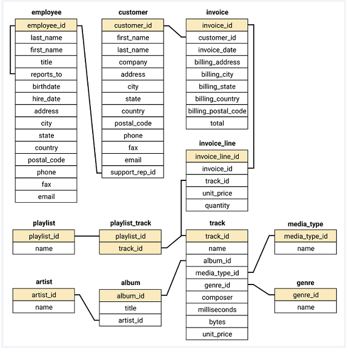

# SQL Project: Music Store Data Analysis [EDA]


## Table of Contents
- [Project Overview](#project-overview)
- [Questions](#questions)
- [Installation](#installation)
- [Contributing](#contributing)


## Project Overview

This SQL project provides a comprehensive analysis of online music store sales data using SQL queries. This project will walk you through from basic data retrieval to advanced insights. This analysis is based on structured question sets to guide the exploration of the music playlist database. In this project I analyszed sales, customer behavior, genres, and more with three levels of difficulty.

## Questions

> Questions based on easy, medium and advanced difficulty provided in questions pdf ⬆
<br>

## Datebase Schema Diagram




## Installation

To run this project locally, you'll need:
- SQL Management Tool (e.g., MS SQl Server)
- Clone of this repository
- Music store database (included)

```bash
git clone https://github.com/yourusername/music-store-analysis.git
```
<br>

## Contributing

Contributions are welcome! If you have ideas for improvements or want to add more questions, please follow these steps:
1. Fork the repository.
2. Create a new branch for your feature: `git checkout -b feature-new-question`
3. Commit your changes: `git commit -m 'Add a new question'`
4. Push to the branch: `git push origin feature-new-question`
5. Submit a pull request.

